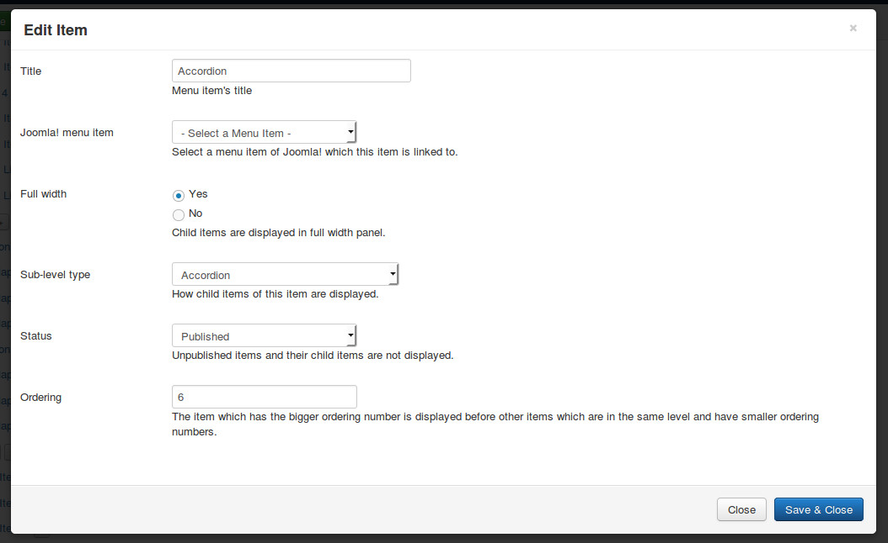
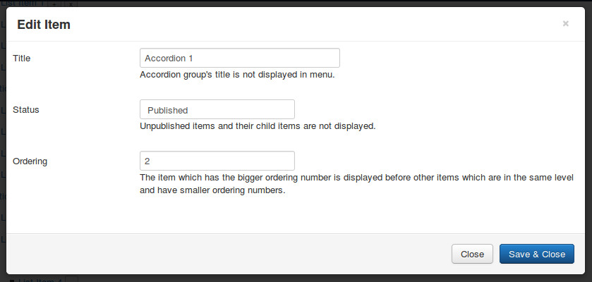
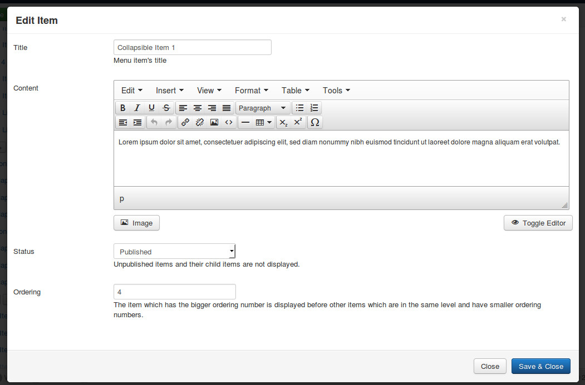
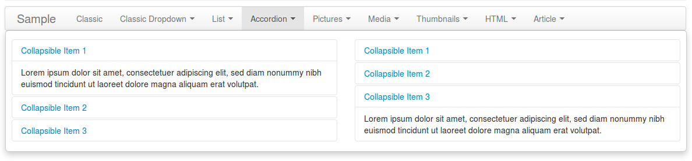

==============
Accordion type
==============

Accordion type uses Bootstrap's Collapse plugin to display collapsible items.

Click "New Level 1 Item" button in menu form to open the form.

* **Title**: the title of menu item, this title is displayed in menu.
* **Joomla! menu item**: do not select any Joomla! menu item.
* **Full width**: select "Yes" to display dropdown panel in full width of menu.
* **Sub-level type**: select "Accordion".
* **Status**: select "Published" to make this menu item visible in your menu, select "Unpublished" if you want to hide it.
* **Ordering**: enter your desired ordering number.

After saving, click + button next to your new menu item's title to create group of collapsible items.

* **Title**: the title of group, this title is not displayed in dropdown panel.
* **Status**: select "Published" to make this section and its items visible in your dropdown panel, select "Unpublished" if you want to hide it and its items.
* **Ordering**: enter your desired ordering number.

Click + button next to your accordion group's title to create its collapsible item.

* **Title**: the title of menu item, this title is displayed in menu.
* **Content**: enter the content of the item.
* **Status**: select "Published" to make this menu item visible in your menu, select "Unpublished" if you want to hide it.
* **Ordering**: enter your desired ordering number.

Example result:

