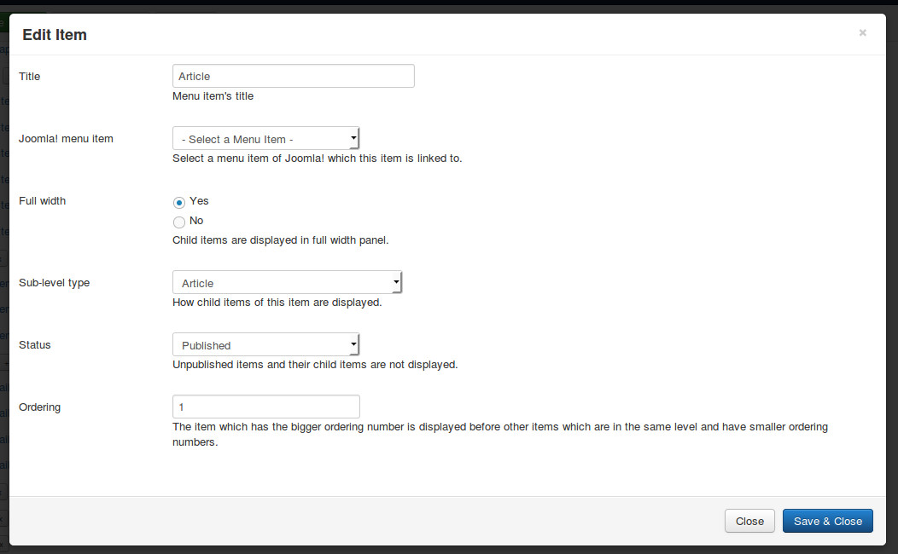
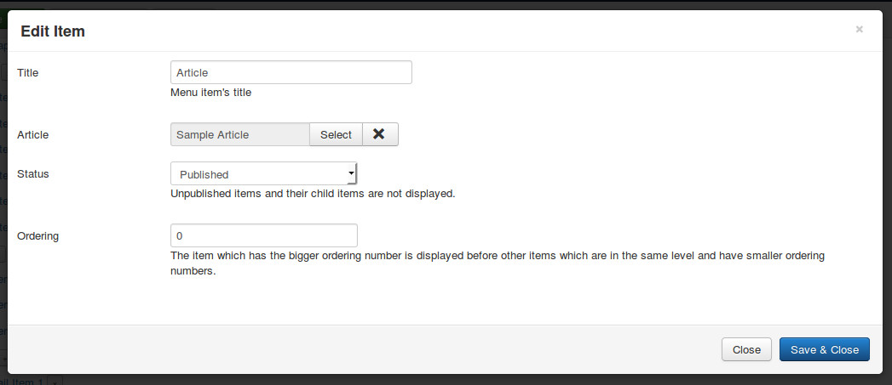
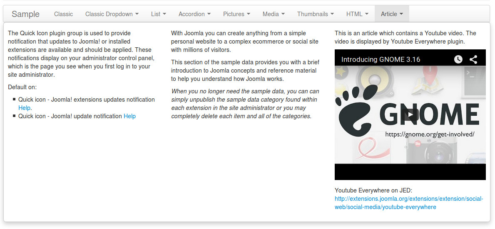

============
Article type
============

Article type is similar to HTML type, used to display HTML output. The only different is instead of composing your HTML output inside CM Mega Menu's item, you get and display the content of a Joomla! article.

Click "New Level 1 Item" button in menu form to open the form.

* **Title**: the title of menu item, this title is displayed in menu.
* **Joomla! menu item**: do not select any Joomla! menu item.
* **Full width**: select "Yes" to display dropdown panel in full width of menu.
* **Sub-level type**: select "Article".
* **Status**: select "Published" to make this menu item visible in your menu, select "Unpublished" if you want to hide it.
* **Ordering**: enter your desired ordering number.

After saving, click + button next to your new menu item's title to create its child item.

* **Title**: the title of menu item, this title is not displayed in dropdown panel.
* **Article**: select a Joomla! article on your site.
* **Status**: select "Published" to make this menu item visible in your menu, select "Unpublished" if you want to hide it.
* **Ordering**: enter your desired ordering number.

You can add other child items. The child items are displayed side by side.

The below screenshot is an example of an Article type menu item with 3 articles. The third article has a Youtube video which is displayed by Youtube Everywhere plugin.

