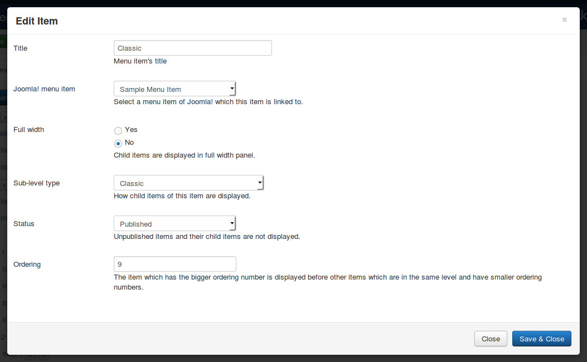
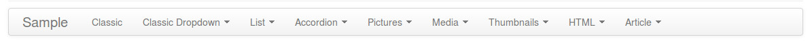
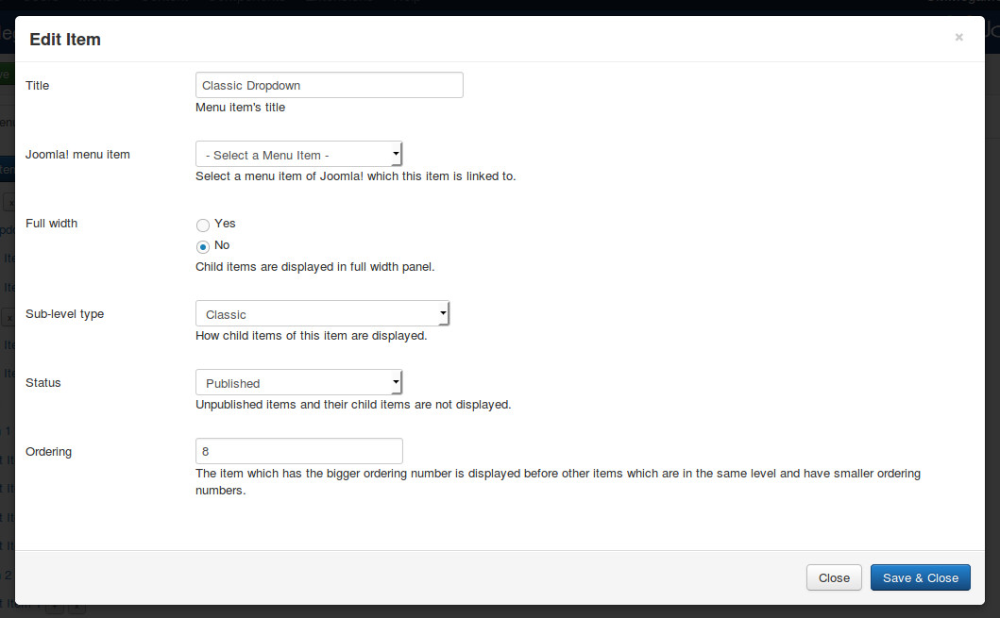
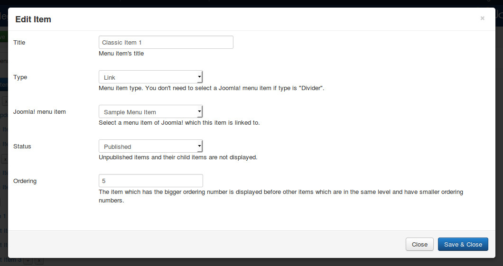
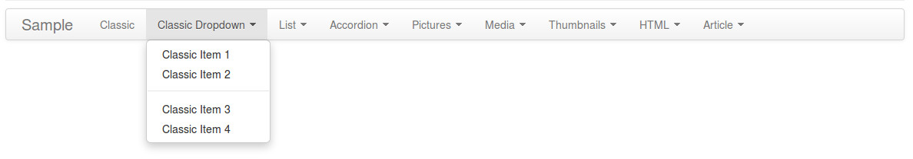

============
Classic type
============

"Classic menu item" is the menu item type which is supported by default in Bootstrap.

Single menu item
----------------

To create single menu item which doesn't have any child menu items. You click "New Level 1 Item" button in menu form to open the form.

* **Title**: the title of menu item, this title is displayed in menu.
* **Joomla! menu item**: select a Joomla! menu item which this new menu item is linked to.
* **Full width**: select "No" as this menu item doesn't have any children.
* **Sub-level type**: select "Classic".
* **Status**: select "Published" to make this menu item visible in your menu, select "Unpublished" if you want to hide it.
* **Ordering**: enter your desired ordering number.

Your single menu item is displayed similar to the "Classic" menu item in the below screenshot:

Dropdown menu item
------------------

To create menu item which displays its child items in a dropdown, you click "New Level 1 Item" button in menu form to open the form.

* **Title**: the title of menu item, this title is displayed in menu.
* **Joomla! menu item**: do not select any Joomla! menu item.
* **Full width**: select "No" as it is not necessasy to display dropdown in full width of menu.
* **Sub-level type**: select "Classic".
* **Status**: select "Published" to make this menu item visible in your menu, select "Unpublished" if you want to hide it.
* **Ordering**: enter your desired ordering number.

After saving, click + button next to your new menu item's title to create its child item.

* **Title**: the title of menu item, this title is displayed in menu.
* **Type**: select "Link" if this menu item is a link, select "Divider" if this menu item is a divider (horizontal line) to separate its above and below items.
* **Joomla! menu item**: do not select any Joomla! menu item.
* **Status**: select "Published" to make this menu item visible in your menu, select "Unpublished" if you want to hide it.
* **Ordering**: enter your desired ordering number.

Here is an example of a classic dropdown menu with 4 links and 1 divider:

