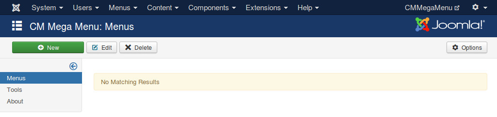

=============
Configuration
=============

In your Joomla!'s back-end, you go to Extensions -> CM Mega Menu to access CM Mega Menu component.

The default page of CM Mega Menu is the list of menus.

On the toolbar there is an "Options" button, you click this button to configure the component.

The menu item is created and managed via AJAX, a notification popup is displayed to let you know the result of the actions or if there is any errors. There are 2 options for this notification feature:

* **Notification position**: Where notification is displayed.
* **Notification's timeout**: How many seconds notification popup is displayed, then it disappears automatcially.

You set "Bootstrap version" option to the Bootstrap version that you use in your front-end.