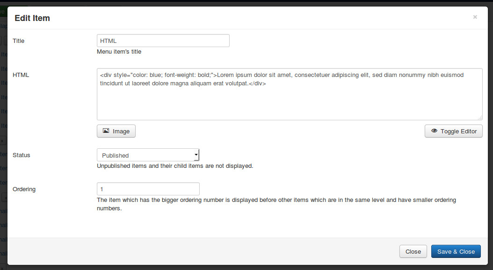
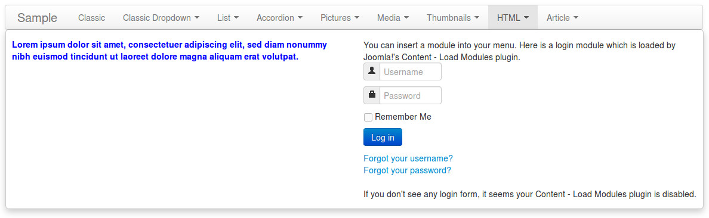

=========
HTML type
=========

With HTML type you can display everything your Joomla! configuration and your installed extensions support.

Click "New Level 1 Item" button in menu form to open the form.

.. image:: ../images/com_cmmegamenu_item_html.jpg

* **Title**: the title of menu item, this title is displayed in menu.
* **Joomla! menu item**: do not select any Joomla! menu item.
* **Full width**: select "Yes" to display dropdown panel in full width of menu.
* **Sub-level type**: select "HTML".
* **Status**: select "Published" to make this menu item visible in your menu, select "Unpublished" if you want to hide it.
* **Ordering**: enter your desired ordering number.

After saving, click + button next to your new menu item's title to create its child item.

* **Title**: the title of menu item, this title is not displayed in dropdown panel.
* **HTML**: enter your HTML's content.
* **Status**: select "Published" to make this menu item visible in your menu, select "Unpublished" if you want to hide it.
* **Ordering**: enter your desired ordering number.

You can add other child items. The child items are displayed side by side.

Here is an example of a HTML menu item with 2 child items. The left item are in bold and in blue font color by using HTML. The right item has a login form by using "Content - Load Modules" plugin to display login module.

