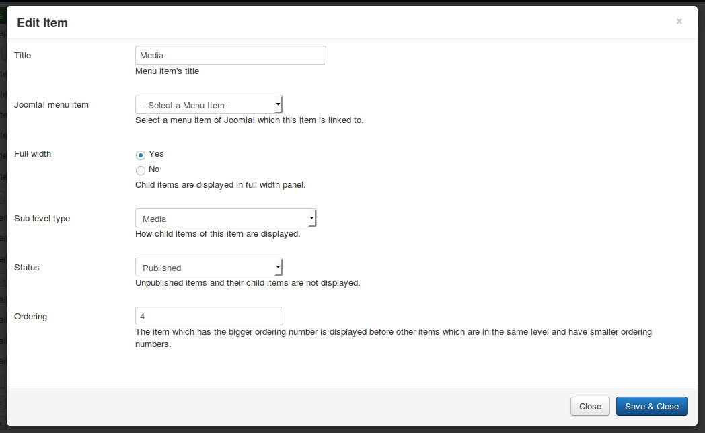
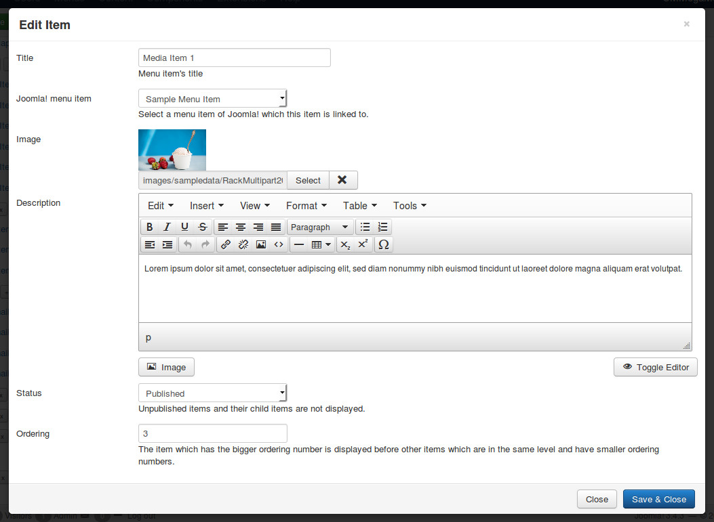
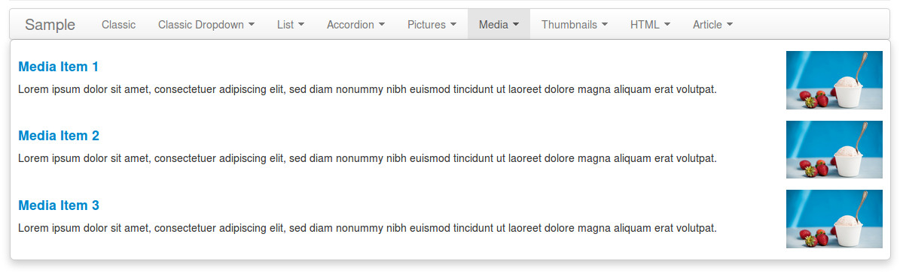

==========
Media type
==========

Media type menu item uses Bootstrap's Media components. With media type menu item, you can display a menu item with a title, a picture and a description.

Click "New Level 1 Item" button in menu form to open the form.

* **Title**: the title of menu item, this title is displayed in menu.
* **Joomla! menu item**: do not select any Joomla! menu item.
* **Full width**: select "Yes" to display dropdown panel in full width of menu.
* **Sub-level type**: select "Media".
* **Status**: select "Published" to make this menu item visible in your menu, select "Unpublished" if you want to hide it.
* **Ordering**: enter your desired ordering number.

Click + button next to the title of the menu item which you just create to add new media.

* **Title**: the title of the media, this title is displayed in the dropdown panel.
* **Joomla! menu item**: select a Joomla! menu item which this media is linked to.
* **Image**: select an image file on your site.
* **Description**: enter a description.
* **Status**: select "Published" to make this menu item visible in your menu, select "Unpublished" if you want to hide it.
* **Ordering**: enter your desired ordering number.

Here is an example result:

