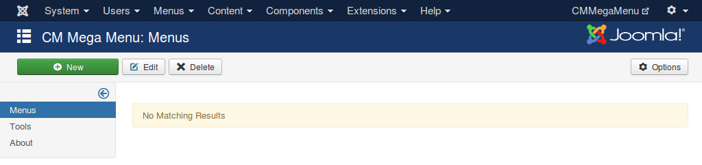
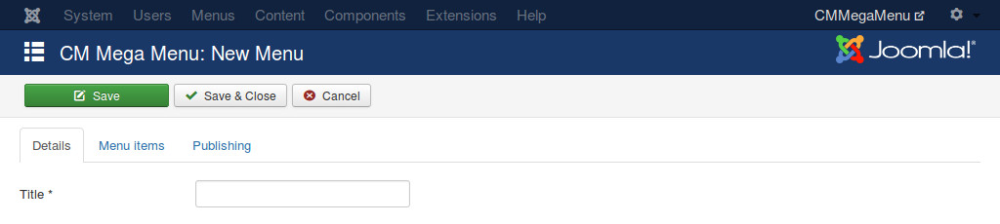
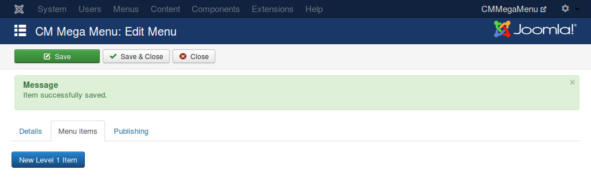
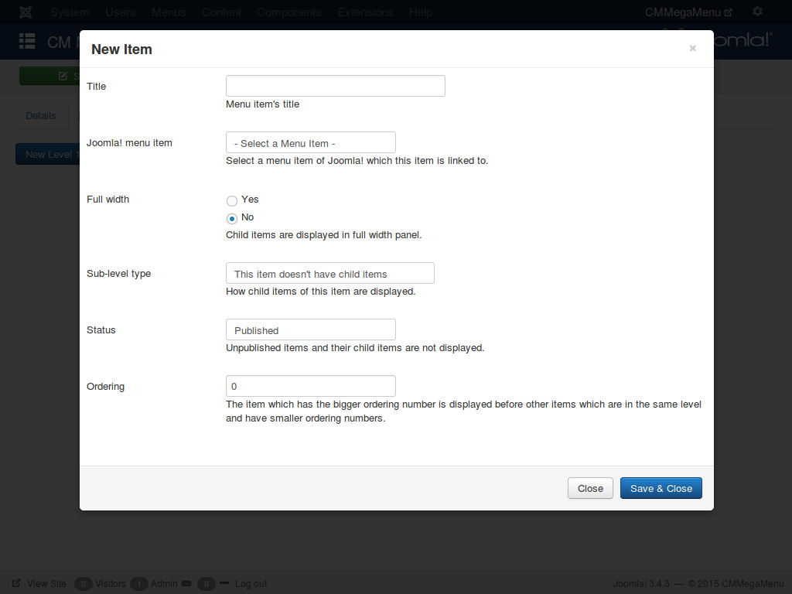
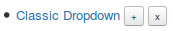

====
Menu
====

In your Joomla!'s back-end, you go to Extensions -> CM Mega Menu to access the list of menus.

Click "New" button on the toolbar to create a new menu.

You need to provide a title for your menu, this title is not visible in front-end.

If you click "Menu items" tab, you receive message "Please save menu before creating menu items for it.". To be able to create menu items for your menu, you need to save your menu.

Click "Save" button on the toolbar to save your menu. After saving, you see "New Level 1 Item" button to create menu item in "Menu items" tab. Level 1 menu items are the menu items which are displayed in your navigation bar (menu), the menu items in the next levels are displayed in dropdown panel when you click on the level 1 ones.

Clicking "New Level 1 Item" opens a popup to create new menu item. Please check the following sections to know how to create menu item for specific types (accordion, pictures,...).

Ordering number
---------------

In menu item's form there is a field "Ordering", this where you enter a number to configure what menu item is displayed first.

The menu item which has a bigger ordering number is displayed before another menu item which has a smaller ordering number.

For example, menu item A has 10 as its ordering number, menu item B has 15 as its orderning number, so menu item B is displayed before menu item A.

Sub-level type
--------------

When you create a new level 1 menu item, in the form there is a dropdown list "Sub-level type", it gives you the following options:

* This item doesn't have child items
* Section
* Accordion
* Classic
* Picture
* Thumbnail
* Media
* HTML
* Article

Once you save a new level 1 menu item, you can not change "Sub-level type" value, this dropdown list is not displayed in the form any more.

The reason of this is every type has its own child quantity, every child menu item has its own configuration, so changing the level 1 menu item's type to a different one will break its child menu items.

For example, if you change a level 1 menu item which has type "Picture" and has 5 pictures as child menu items to "Article" type, those 5 pictures can't be used any more, they can't be merged into article or displayed side by side to article's content.

So if you want to change "Sub-level type" of a level 1 menu item, the only way is deleting that menu item and its children, then creating a new menu item.

Create and delete menu items
----------------------------

To create a new level 1 you click "New Level 1 Item" button.
To create child item of a level 1 item or child item of another child item, you click on the + button next to title.
To delete a menu item, you click on the x button next to the title.
Below is a screenshot of these buttons:

