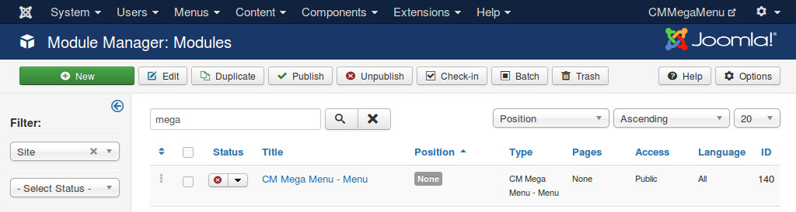

===========
Menu module
===========

After creating your menu, you need to use CM Mega Menu module to display the module in your front-end.

You go to Extensions -> Module Manager, search for "CM Mega Menu - Menu", this is a module which is created automatically when you install CM Mega Menu package.

Click the title of the module to edit.

In "Module" tab, you configure the module like other Joomla! modules (select menu items, select template position,...). In "Options" tab you need to configure the following options:

* **Menu**: select a menu you want to display.
* **Show module's title on menu**: if you select "Yes", the title of the module is displayed on the left edge of the menu module.
* **Title's link**: if you set "Show module's title on menu" to "Yes", you can enter a URL here, when visitor clicks module's title, visitor is taken to this URL.
* **Bootstrap debug**: this option is only used for developers for debugging, if you set this option to "Yes", you can add "bootstrap" parameter to your front-end's URL to display the module in a specific Bootstrap version, "bootstrap=3" is used for Bootstrap 3 debug, while "bootstrap=2" is for Bootstrap 2.
