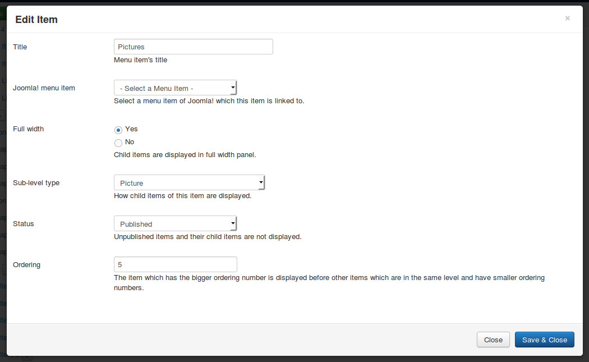
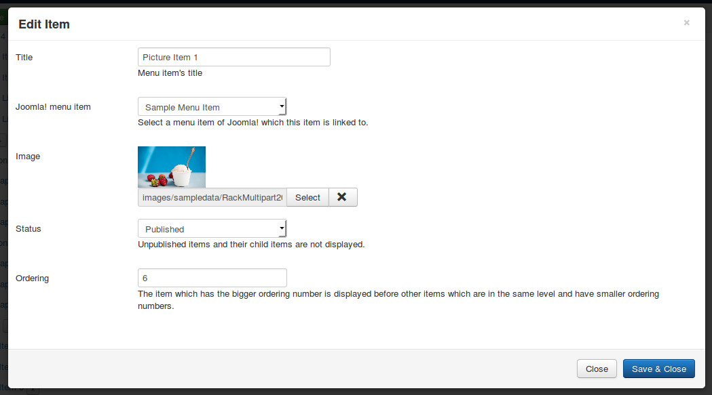
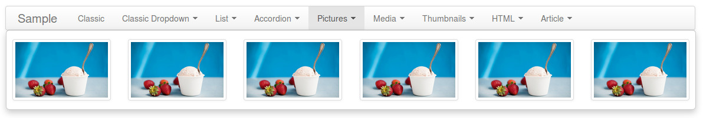

============
Picture type
============

Picture type displays pictures as menu items.

Click "New Level 1 Item" button in menu form to open the form.

* **Title**: the title of menu item, this title is displayed in menu.
* **Joomla! menu item**: do not select any Joomla! menu item.
* **Full width**: select "Yes" to display dropdown panel in full width of menu.
* **Sub-level type**: select "Picture".
* **Status**: select "Published" to make this menu item visible in your menu, select "Unpublished" if you want to hide it.
* **Ordering**: enter your desired ordering number.

Click + button next to the title of the menu item which you just create to add new picture.

* **Title**: the title of the picture, this title is not displayed in your menu.
* **Joomla! menu item**: select a Joomla! menu item which this picture is linked to.
* **Image**: select an image file on your site.
* **Status**: select "Published" to make this menu item visible in your menu, select "Unpublished" if you want to hide it.
* **Ordering**: enter your desired ordering number.

This is an example of picture type menu item:

