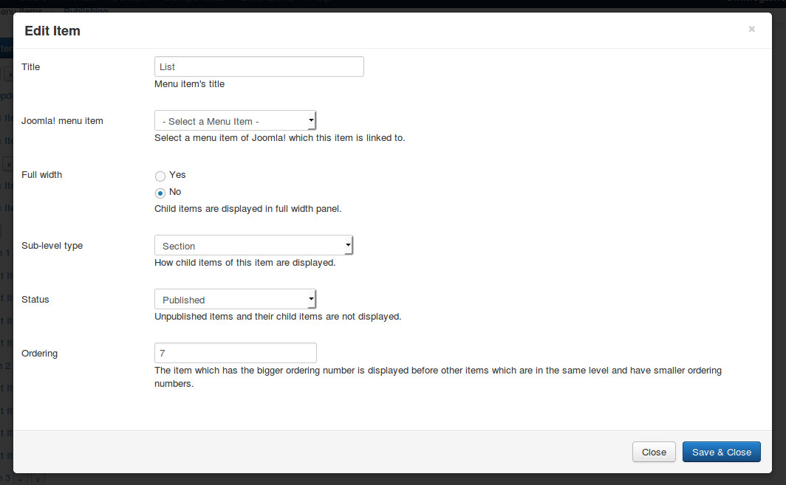
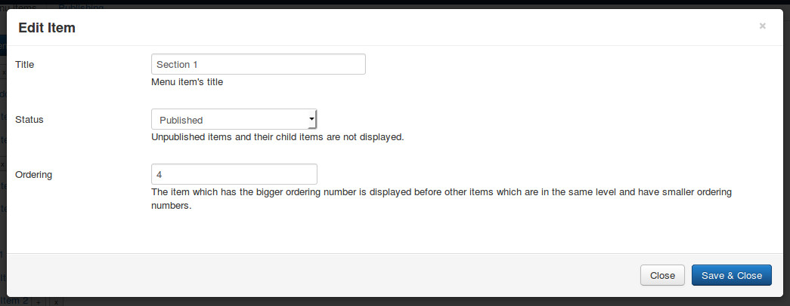
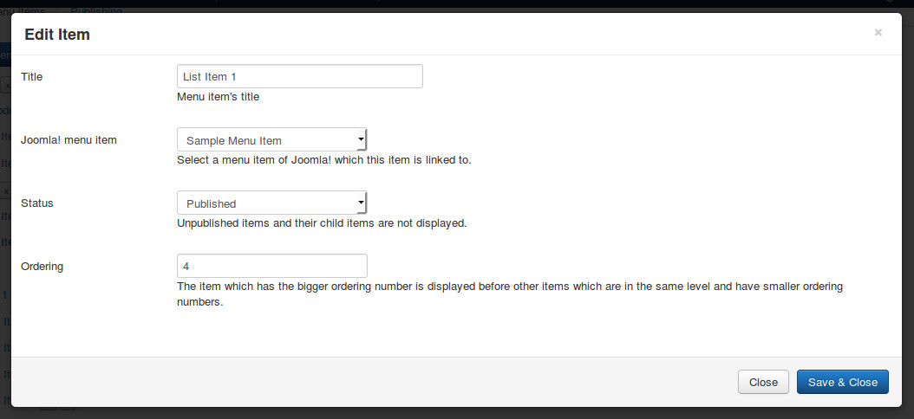
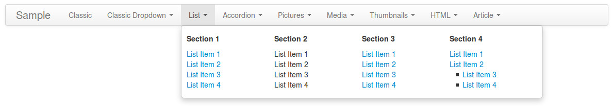

============
Section type
============

Section type displays the menu items which are grouped into sections.

Click "New Level 1 Item" button in menu form to open the form.

* **Title**: the title of menu item, this title is displayed in menu.
* **Joomla! menu item**: do not select any Joomla! menu item.
* **Full width**: select "Yes" if you want to display dropdown panel in full width of menu.
* **Sub-level type**: select "Secion".
* **Status**: select "Published" to make this menu item visible in your menu, select "Unpublished" if you want to hide it.
* **Ordering**: enter your desired ordering number.

After saving, click + button next to your new menu item's title to create section.

* **Title**: the title of section, this title is displayed in dropdown panel.
* **Status**: select "Published" to make this section and its items visible in your dropdown panel, select "Unpublished" if you want to hide it and its items.
* **Ordering**: enter your desired ordering number.

Click + button next to your section's title to create its menu item.

* **Title**: the title of menu item, this title is displayed in menu.
* **Joomla! menu item**: select a Joomla! menu item which this menu item is linked to, if there is no Joomla! menu item selected, this menu item is displayed as text.
* **Status**: select "Published" to make this menu item visible in your menu, select "Unpublished" if you want to hide it.
* **Ordering**: enter your desired ordering number.

For every menu item, you can create another level of menu item.

Here is an example of 4 sections, "Section 2" has 4 text items instead of links, "Section 4" has a menu item ("List Item 2") which has child menu items.

