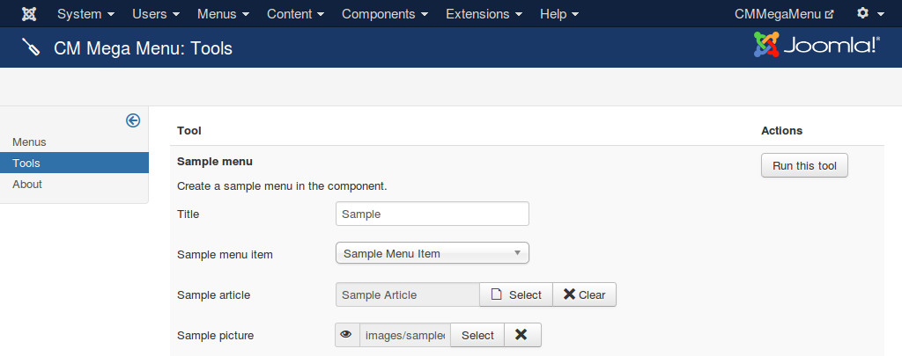

=====
Tools
=====

In your back-end you go to Components -> CM Mega Menu, click "Tools" on the left side menu. At the present time there is only 1 tool for creating a sample menu for demonstration. This sample menu includes all the menu item types available in CM Mega Menu, they could help you in seeing how CM Mega Menu is configured.

There are 4 options you need to provide. When you click "Run this tool" button, a sample menu is created for you.

* **Title**: the title of sample menu.
* **Sample menu item**: select a Joomla! menu item, this menu item is assigned to sample menu items.
* **Sample article**: select a Joomla! article for Article type menu item.
* **Sample picture**: select an image file on your site to use it for Media, Thumbnail, Picture types.